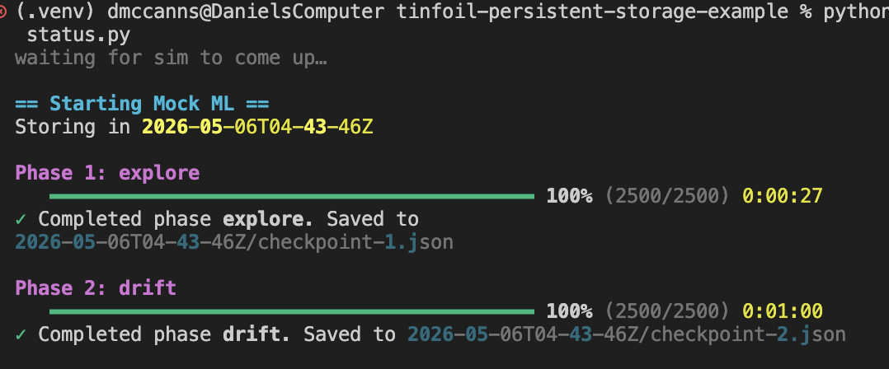
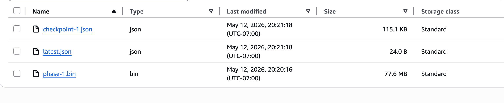
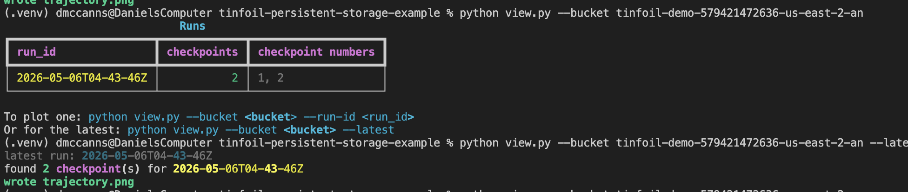
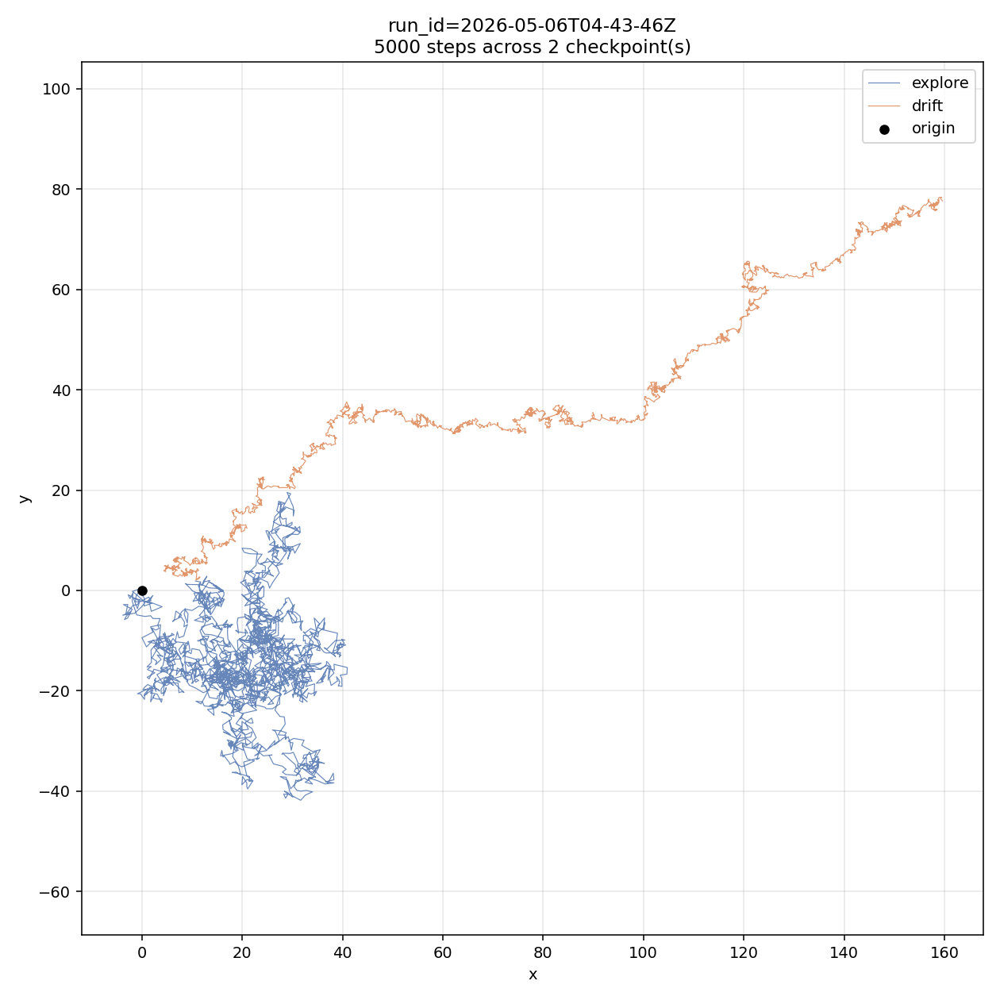

# Persistent (encrypted) storage example

Tinfoil containers are ephemeral. This example shows how to checkpoint long-running work to an encrypted S3 bucket to avoid losing results, restart from a checkpoint, and stream a large per-phase payload to S3 as it's produced.

Behind the scenes it uses [tinfoil-bucket-sidecar](https://github.com/tinfoilsh/tinfoil-buckets-sidecar), a local server that exposes an S3 compatible API that handles encryption for you, using S3s encrypted client package.

The workload is a mock 4-phase random walk (explore → drift → converge → oscillate). Each phase produces:

- a small **JSON checkpoint** (rng state, trajectory, metadata) — single PUT at phase end, used for resume + plotting
- a large **.bin blob** of mock per-step "activations" — **streamed** to S3 via multipart upload as the phase runs, one part flushed every time the buffer crosses 5 MB

Restartable from any JSON checkpoint. The streamed .bin files are pure baggage — they exist to demonstrate the streaming path, not to be re-read on resume.

The guide deploys in **[debug mode](https://docs.tinfoil.sh/containers/debug-mode)** by default — SSH access + container logs, **no attestation**. Use this for iteration and testing.

## Quick start

Follow **[guide.md](./guide.md)** for the full walkthrough: aws setup, tinfoil secrets, tag, deploy.

The short version (assuming aws + tinfoil are already set up):

1. Edit `tinfoil-config.yml` — set `S3_BUCKET` and `AWS_REGION`.
2. Push aws creds + your SSH key to your tinfoil org once:
   - `tinfoil secret create AWS_ACCESS_KEY_ID --value-file -` (and same for `AWS_SECRET_ACCESS_KEY`)
   - `tinfoil ssh-key create laptop --public-key-file ~/.ssh/id_ed25519.pub`
3. Tag a release — `gh workflow run tinfoil-build.yml -f version=v0.1.0 --ref $(git branch --show-current)`. Wait for the actions, then `git pull`.
4. Create the container in debug mode — `tinfoil container create persistent-storage-sim --repo <owner>/<repo> --tag v0.1.0 --debug --ssh-key laptop --secret AWS_ACCESS_KEY_ID --secret AWS_SECRET_ACCESS_KEY`. Domain will be `<name>.debug.<org>.containers.tinfoil.dev`.
5. Watch — `python status.py --url https://<domain>/status`. To shell in: `ssh -p <port> root@console.tinfoil.sh` (port shown in `tinfoil container get`).
6. Plot — `python view.py --bucket $S3_BUCKET --latest`.

## What the output should look like

`python status.py` — colored per-phase progress bar, ticks through `explore → drift → converge → oscillate`, shows live multipart-upload state (idle / flushing, parts uploaded, bytes streamed), prints the saved checkpoint path after each phase:



In S3 you'll see, per run: small JSON checkpoints next to ~80 MB streamed `phase-N.bin` blobs:



`python view.py --bucket $S3_BUCKET` — list every run in the bucket, then `--latest` to render the most recent:



The output `trajectory.png` — color-coded by phase. Below is a 2-checkpoint run (interrupted before `converge`), to show what an in-progress trajectory looks like.



## Layout

```
container/
  sim.py           random walk + per-step activation streaming + checkpointing
  storage.py       boto3 wrapper (single PUT + multipart upload helpers)
  server.py        /health + /status (incl. live MPU telemetry)
  Dockerfile       python:3.13-slim — built by tinfoil-build.yml github action
  requirements.txt
view.py            local — pulls JSON checkpoints from s3, plots trajectory.png
status.py          local — colored per-phase progress bar + live upload state
tinfoil-config.yml cpus 2 / mem 8192, AWS creds as secrets, exposes /health + /status
guide.md           full walkthrough
```

S3 layout under `s3://$S3_BUCKET/persistent-storage/{run_id}/`:

```
checkpoint-{N}.json   — small: rng state, trajectory, metadata (single PUT)
phase-{N}.bin         — large: streamed per-step activations (multipart upload)
latest.json           — pointer to the highest N written
```

`run_id` is a UTC timestamp (`YYYY-MM-DDTHH-MM-SSZ`).

To resume: set `command: ["--resume-from", "<run_id>:N"]` in `tinfoil-config.yml`, tag a new release, then `tinfoil container relaunch ... --tag v0.1.1`. Sim loads `checkpoint-N.json`, restores the numpy rng state, and picks up at the start of phase N+1. The `.bin` files for already-completed phases are not re-read — they're baggage. Because the rng is restored, the resumed run is byte-identical to an uninterrupted one.

## How the streaming works

Each step appends a record (`int32 dim` + `float32[dim]`) to an in-memory buffer. `dim` is jittered per step (default 8192 ± 2048) so parts contain uneven numbers of steps — the demo exercises buffer policy on real variable-size records, not a fixed stride. When the buffer crosses `PART_SIZE_MB` (default 5 MB), the **same step loop** blocks on `upload_part` before continuing. No background thread, no queue — the sim's progress _is_ the upload's progress. If the network is slow, the sim is slow.

When the phase ends, the final part (any size — S3's 5 MB minimum is for non-last parts only) is uploaded and `complete_multipart_upload` finalizes the object. If anything raises mid-phase, `abort_multipart_upload` runs in a `finally` so we don't leave orphaned parts on the bucket.

> **A note on size.** A real training workload would dump hundreds of MB to GB per checkpoint — large enough that single PUT is a non-starter and MPU is the only sensible option. Here the per-phase `.bin` is closer to ~80 MB at default settings, which a single PUT could handle. The mechanics are identical at any size; the demo handwaves the absolute volume. Bump `BAGGAGE_DIM_BASE` if you want larger objects.

### Env knobs (set in `tinfoil-config.yml`)

| var                  | default | what                                                 |
| -------------------- | ------- | ---------------------------------------------------- |
| `BAGGAGE_DIM_BASE`   | 8192    | mean activations per step (float32)                  |
| `BAGGAGE_DIM_JITTER` | 4096    | per-step uniform jitter on `dim` (`base ± jitter/2`) |
| `PART_SIZE_MB`       | 5       | buffer threshold for an MPU part flush               |
| `SEED`               | unset   | optional numpy rng seed                              |

### Lifecycle policy for orphaned parts

If a container OOMs or is force-killed, the `finally`-guarded abort can't run and orphaned MPU parts will sit in the bucket racking up storage charges until you clean them. Add this to the bucket lifecycle config to auto-reap any incomplete uploads after 1 day:

```json
{
  "Rules": [
    {
      "ID": "abort-incomplete-mpu",
      "Status": "Enabled",
      "Filter": { "Prefix": "persistent-storage/" },
      "AbortIncompleteMultipartUpload": { "DaysAfterInitiation": 1 }
    }
  ]
}
```

## Check s3 works

`.env` (copy from `.env.example`) is handy throughout — sourcing it gives you `$S3_BUCKET`, `$AWS_REGION`, and your aws creds. Useful for both the aws CLI and for `tinfoil secret create` later.

```bash
cp .env.example .env
$EDITOR .env
set -a && source .env && set +a

# round-trip should print `hi`
echo hi | aws s3 cp - s3://$S3_BUCKET/_smoke && aws s3 cp s3://$S3_BUCKET/_smoke - && aws s3 rm s3://$S3_BUCKET/_smoke
```

If that errors, your aws creds or bucket name are off. Fix that before deploying.

## Promote to prod

Debug mode is for iteration and testing. When you're ready for the real security guarantees, switch to production:

```bash
tinfoil container relaunch persistent-storage-sim --debug false
```

Production mode gives you attestation (verified enclave) and drops SSH + container logs. Domain moves back to `<name>.<org>.containers.tinfoil.dev`.

## Future work

Currently this example uses a simple S3 storage.

There are two more possible options if the storage needs to be encrypted:

1. **Tinfoil buckets** (beta) — manages the encryption for you. [github](https://github.com/tinfoilsh/tinfoil-buckets-sidecar)
2. **Custom s3 + caller-owned encryption** — more work, but specific control over how things are stored
